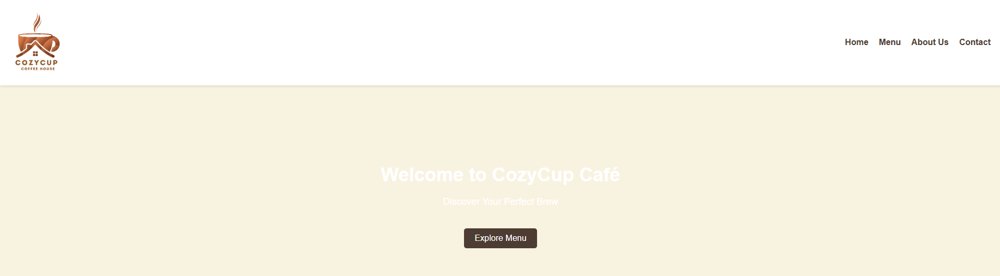
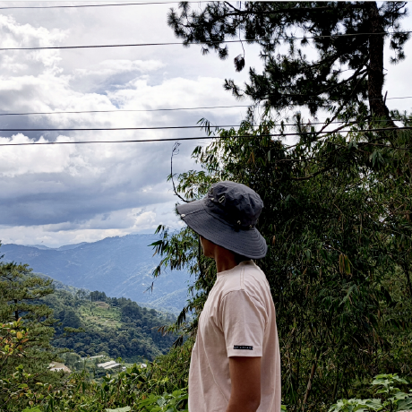
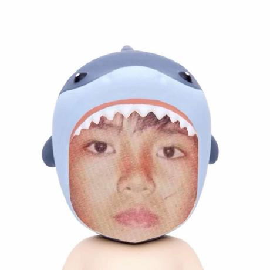

#  COZYCUP CAFE

## Project Descirption
Cozy Cup Cafe is a web-based application designed to bring the warm, inviting atmosphere of a local coffee shop to the digital world. This project focuses on providing a seamless browsing experience for customers to explore our seasonal blends, specialty pastries, and cozy seating options.

## Features
* User-friendly and cozy café-themed user interface  
* Home section introducing the café    
* Menu section introducing our offered food and drinks 
* About Us section introducing our story 
* Contact section for customer feedback

## Screen Captures

* Home Screen – This section displays the main landing page of the Cozy Cup Cafe with a light, warm and user-friendly design.

* Menu Screen – This section shows the list of offered food and drinks available.

* About Us Screen – This section shows the story of Cozy Cup Cafe, its origin, its vision and its passion for coffee and the relaxing space it offerd.

* Contact Us Screen – This section shows Cozy Cup Cafe’s contact details, a simple feature for customers to reach out and give feedbacks.

## About the Authors

**Name:** Obed G. De Belen

**Email:** 202180184@psu.palawan.edu.ph

**Name:** Glenn Paul Bryan S. Dela Cruz

**Email:** 202040020@psu.palawan.edu.ph

